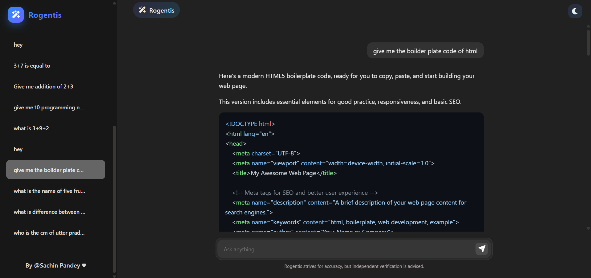
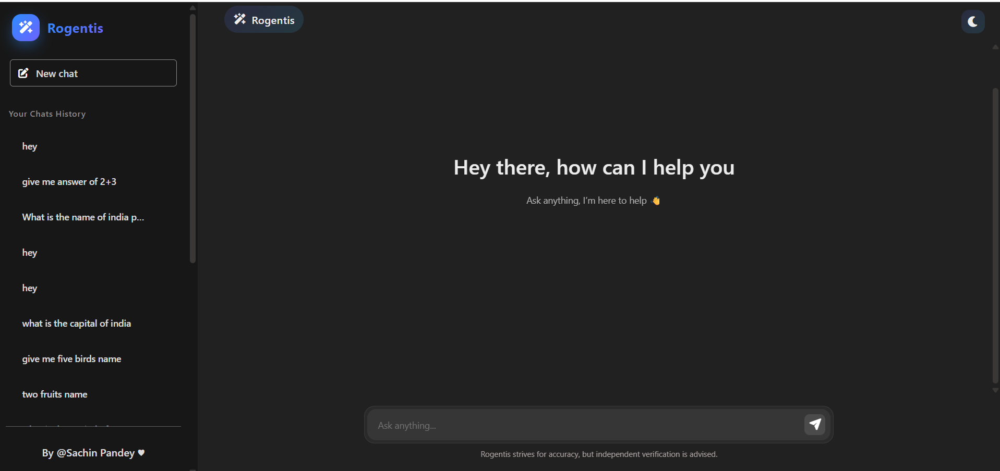
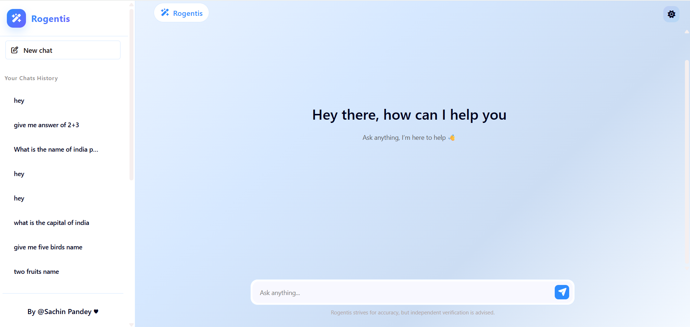

## 🌐 Live Demo

👉 https://your-deployed-link.com

# 🚀  Rogentis     

### Intelligent AI Assistant. Ask anything.


---

## 📌 Overview

**Rogentis** is a full-stack AI-powered conversational platform built using React, Node.js, Express, MongoDB, and Google Gemini API.

It provides:

- 💬 Real-time AI chat responses  
- 🧠 Context-based thread storage  
- 📂 Persistent chat history  
- 🌙 Dark / Light mode support  
- 📱 Fully responsive UI  

Each conversation is stored as a thread in MongoDB, allowing users to revisit and manage previous chats.

---

## ✨ Features

- 🔥 AI chat powered by Gemini API
- 🧵 Thread-based chat history
- 🗑 Delete specific chat threads
- 📂 Persistent database storage (MongoDB)
- 🌙 Dark & Light theme toggle
- 📱 Responsive sidebar with mobile support
- ✍️ Markdown support with syntax highlighting
- ⚡ Typing animation effect for AI replies
- 🎨 Modern, clean UI inspired by ChatGPT

---

## 🛠 Tech Stack

### 🔹 Frontend
- React 19
- Vite
- React Markdown
- Rehype Highlight (code syntax highlighting)
- React Spinners
- UUID

### 🔹 Backend
- Node.js
- Express 5
- MongoDB
- Mongoose
- CORS
- dotenv

### 🔹 AI Integration
- Google Gemini API
- Custom prompt enhancement logic

---

## 🚀 Installation

### 1️⃣ Clone the Repository

```bash
git clone https://github.com/Sachin23Pandey/Rogentis.git

```


## 2️⃣ Create .env files
#### 📁 Inside the backend/ folder

Create a file named `.env` and paste your credentials:

```bash
MONGODB_URL=your_mongodb_url_here
GEMINI_API_KEY=your_gemini_api_key

```

>**⚠️ Important: Without setting these environment variables, the website will not function properly.**

## 3️⃣Setup Backend and Frontend ;

#### Frontend Part: 


Navigate to Frontend Folder and write these commands : 
```bash
npm install
npm run dev
```
#### Backend Part: 
Navigate to Backend Folder and write these commands : 
```bash
npm install
npm run dev
```


Now! You’re all set 🎉!

---

## ▶️ Usage

- Open the frontend in browser.
- Start a new chat.
- Enter your message.
- AI response will be generated and stored in MongoDB.
- View previous conversations from sidebar.
- Switch between Light / Dark mode.
---

## 📸 Screenshots






---

## 📂 Project Structure

```
Rogentis/
│
├── backend/
│ ├── server.js
│ ├── routes/
│ │ └── chat.js
│ ├── models/
│ │ └── Thread.js
│ ├── utils/
│ │ └── geminiai.js
│ └── package.json
│
├── frontend/
│ ├── src/
│ │ ├── App.jsx
│ │ ├── Chat.jsx
│ │ ├── ChatWindow.jsx
│ │ ├── Sidebar.jsx
│ │ ├── MyContext.jsx
│ │ └── styles...
│ └── package.json
│
├── screenshots/
│ ├── chat.png
│ ├── dark-mode.png
│ └── light-mode.png
│
└── README.md

```

## ⚠️ Disclaimer

Rogentis strives for accuracy, but independent verification is advised.
Always verify critical or important information before relying on it.

---

## 📈 Future Plans

- 🔐 User Authentication (JWT / OAuth)
- 🧠 Context-aware multi-turn AI memory
- 📄 Export chat to PDF
- 🎙 Voice input support
- 🌍 Multi-language support
- 📊 Analytics dashboard

---

## 🤝 Contributing & Feedback

Contributions are welcome!

If you would like to improve MyGPT:

- Fork the repository
- Create a new branch
- Make your changes
- Submit a Pull Request

Please open an issue first for major changes.

---

## 📄 License

This project is licensed under the MIT License.

---


## 🧑‍💻 **Connect With Me**

>Built with ❤️ by Sachin Pandey

- 🌐 [**GitHub**](https://github.com/Sachin23Pandey)  
- 💼 [**LinkedIn**](https://linkedin.com/in/sachin-pandey-9455a7262)

---


